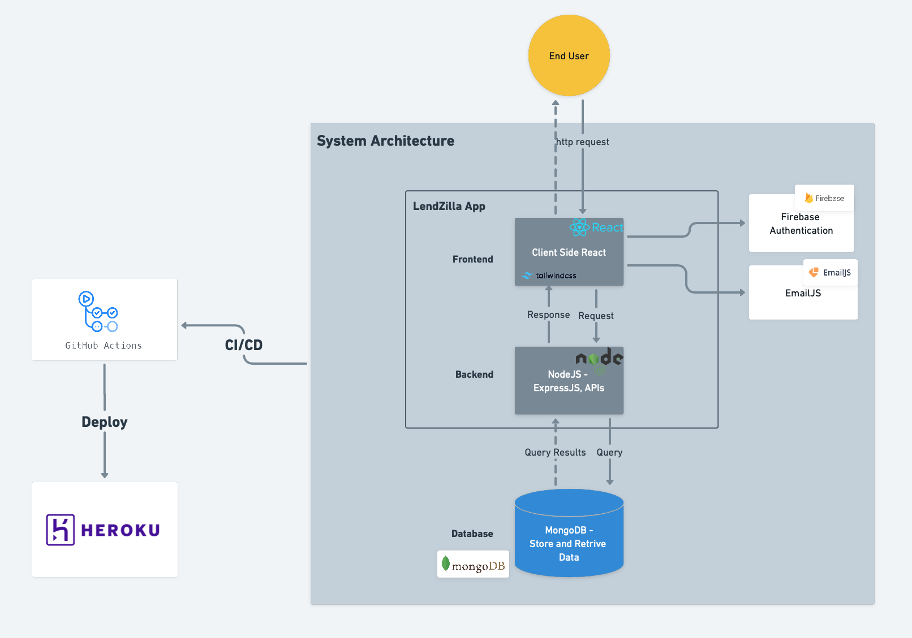
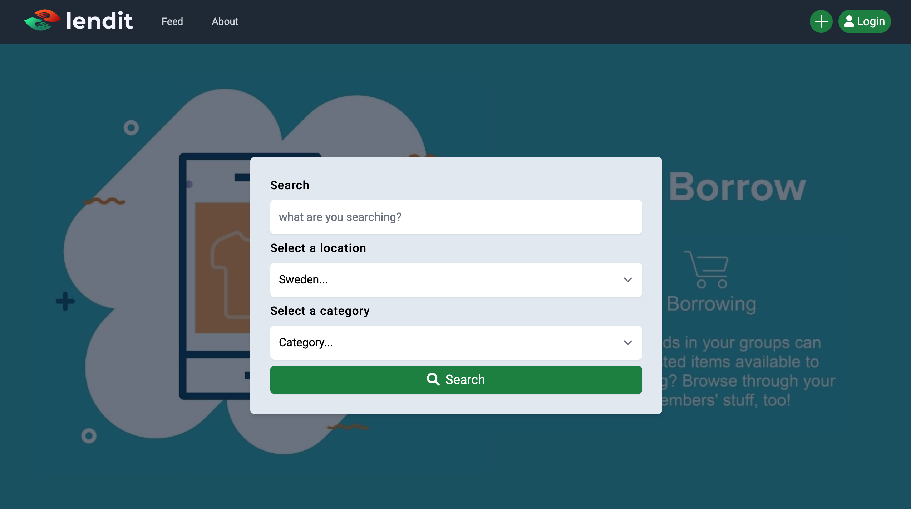
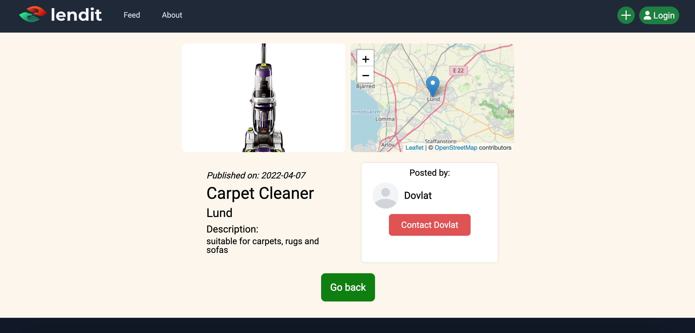

<p align="center">

</p>

# Lendit

Lendil is a platform where users can lend their items to others or borrow things that they need. We are a network that brings people together to live sustainably. It's a platform that you may use on your phones, tablets, laptops, and computers.

## Story

Lendit community was founded in Stockholm in 2022 with an ambitious mission to transform the world into a place where everyone tries to live sustainably and contributes in to minimising overconsumption. We have created a space for people with the similar vision to find each other, come together and share.

## Purpose

- Provides an environment where users can:
- find items that they want to borrow
- publish items that they can share with others

## Preview

Follow this link to see the project: https://lending-app-codezilla.herokuapp.com

You will need to create an account to have access to all services of the website, or have a limited access as a guest user.

## System Architecture



## Setup
Our development environment for a full-stack web application will consist of three main parts:

1. Database (MongoDB).
2. Backend server (NodeJS, ExpressJS).
3. Frontend development server (React).

### Prerequisites
To run our app locally, you will need to add a .env file with an API key to your MongoDB database.

### Starting the backend server
Open the directory `server` and run
```
npm install
```
to install all the dependencies needed for the project.

Then start the server by running
```
npm start
```

### Starting the frontend development server
The frontend application is in the directory `client`. From there, run 
```
npm install
```
to install all the dependencies needed for the project.

Then start the frontend application by running
```
npm start
```

## REST API

We have implemented API in NodeJS, ExpressJS with MongoDB database. 

# User Manual

## Signup page

Users can Sign up via entering Name, Email and password when they are not registered.

### Feed page
As soon Users register, It lands to home page, where they can search 
and then see posts of the available items on the feed page.



### Item details
When you click on one of the items, a details page would appear with the information like
description, date, a map, etc.



### Profile page

Users can see their information on the profile page.

### About page

User can find the vision and mission of our app in the above page. This page can be accessed by clicking "about" in navigation.

### Contact page

User can contact the community via contact-form for some question or suggestions, accessible via my profile.


# Author

Created between March 28 - April 07 2022 as a final group project for </salt> by:

- Dovlat Yakshibayev
- Leila Mahmoudi
- Natalia Fedorova
